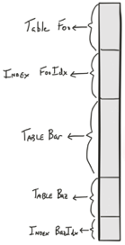

@snap[midpoint span-100]
## CockroachDB
### A Brief Overview
@snapend

---
## Agenda

@snap[midpoint text-left span-100]
@ul[spaced text-25]
- **What is CockroachDB?**
- **How is data stored?**
- **How is data replicated and distributed?**
- **How do reads and writes behave in CockroachDB?**
- **How does CockroachDB tolerate failures?**
@ulend
@snapend

---
## Agenda

@snap[midpoint text-left span-100]
@ul[spaced text-25]
- **What is CockroachDB?**
@ulend
@snapend

---

## What is CockroachDB?
### FAQ Answer

@snap[midpoint span-100]
"*CockroachDB is a distributed SQL database built on a transactional and strongly-consistent key-value store.*" - [FAQs: What is CockroachDB?](https://www.cockroachlabs.com/docs/v19.1/frequently-asked-questions.html#what-is-cockroachdb)
@snapend

---

## What is CockroachDB?
### A distributed database

@snap[midpoint span-40]

@snapend

@snap[south span-100]
@ul[spaced]
- A **node** is a machine running CockroachDB.
- A **cluster** is a group of connected nodes that acts as a single, logical application.
@snapend

---

## What is CockroachDB?
### What's in an instance of CRDB?

@snap[midpoint span-100]
@ul[spaced]
- A SQL client.
- A key-value store.
- Some other components in between that handle distributing, replicating, and storing data in a way that guarantees **ACID** properties.
@snapend

---

## What is CockroachDB?
### Architecture

@snap[midpoint span-100]
@ul[spaced]
- **SQL** Layer: "*Exposes the SQL API to developers and converts SQL statements into key-value operations used by the rest of the database.*"
- **Transactional** Layer: "*Implements support for ACID transactions by coordinating concurrent operations.*"
- **Distribution** Layer: "*Provides a unified view of your cluster's data.*"
- **Replication** Layer: "*Copies data between nodes and ensures consistency between these copies by implementing our consensus algorithm.*"
- **Storage** Layer: "*Reads and writes data to disk.*"
@ulend
@snapend

---
## Agenda

@snap[midpoint text-left span-100]
@ul[spaced text-25]
- What is CockroachDB?
- **How is data stored?**
@ulend
@snapend

---

## Storage
### How is data stored in CockroachDB?

@snap[west span-100]
@ul[spaced]
- Users access data through the **SQL interface** as entries in rows and columns of a table. From a user's perspective, data is represented as being in one place.
- Under the hood, CockroachDB stores data, including rows of table data, indexes, and metadata in a **key-value store** (RocksDB) that is partitioned, replicated, and distributed across multiple machines.
@ulend
@snapend

---

## Storage
### Key-value store

@snap[east text-right span-100]

@snapend

@snap[west text-left span-100]
The "keyspace" can be represented as a monolothic, sorted map.
@snapend

---

## Storage
### Key-value store

@snap[east text-right span-100]

@snapend

@snap[west text-left span-100]
This keyspace is partitioned into ranges.
@snapend

---

## Agenda

@snap[midpoint text-left span-100]
@ul[spaced text-25]
- What is CockroachDB?
- How is data stored?
- **How is data replicated and distributed?**
@ulend
@snapend

---

## Replication & Distribution
### How is data replicated and distributed in CockroachDB?

@snap[east text-right span-100]

@snapend

@snap[west text-left span-55]
@ul[spaced]
- Data in the key-value store is partitioned into **ranges** of up to 64 MiB.
- Each range is replicated and distributed to a default minimum of three nodes on a cluster.
@ulend
@snapend

---

## Replication & Distribution
### How is data replicated and distributed in CockroachDB?

@snap[midpoint span-100]
@ul[spaced]
- When data in a range grow larger than 64 MiB, the range is split, replicated, and distributed across the cluster.
- It's easy to scale CockroachDB horizontally. Just add new nodes to a cluster, and it will rebalance loads automatically.
@ulend
@snapend

---

## Replication & Distribution
### Consensus with Raft

@snap[midpoint span-100]
@ul[spaced]
- CockroachDB uses the Raft consensus algorithm to guarantee that data is consistent across replicas.
- Raft groups replicas of the same range into a **Raft group**. There is one Raft group per range.
- Each group has a single **leader**. All other replicas are **followers**.
- Each replica holds a **Raft log**, which contains the time-ordered writes to its range. The majority of replicas must agree to a write before it can be written to the log.
@ulend
@snapend

---

## Replication & Distribution
### Raft Elections

@snap[west span-50]
@ul[spaced]
- The leader periodically distributes the latest log of writes to the followers in the group.
- If a follower does not hear from the leader within a time period, that follower starts a new election.
@ulend
@snapend

@snap[east span-50]

[Ongaro and Ousterhout (2014)](https://www.usenix.org/system/files/conference/atc14/atc14-paper-ongaro.pdf)
@snapend

---

## Replication & Distribution
### Leaseholders

@snap[midpoint span-100]
@ul[spaced]
- For each range, there is a replica that holds a **range lease**. This replica is known as the **leaseholder**, (usually the same as the Raft leader). This replica manages the read and write requests for its range.
- When a user submits a SQL statement, the gateway node identifies the leaseholder for the range of interest, and sends the read or write request to the leaseholder.
@ulend
@snapend

---

## Agenda

@snap[midpoint text-left span-100]
@ul[spaced text-25]
- What is CockroachDB?
- How is data stored?
- How is data replicated and distributed?
- **How do reads and writes behave in CockroachDB?**
@ulend
@snapend

---

## Reading & Writing
### How do reads work in CockroachDB?

@snap[midpoint span-100]
@ul[spaced]
- A SQL query is issued from a gateway node.
- The gateway node locates node with the leaseholder replica for the range of interest.
- All read and write requests go through the leaseholder, so that replica contains the latest, verified range data.
- For reads, the leaseholder simply sends back the requested data to the gateway node.
@ulend
@snapend

---
## Reading & Writing
### Example cluster: 3 nodes, 3 tables, 3 ranges, 3 replicas

@snap[midpoint span-100]

@snapend

---

## Reading & Writing
#### Read Scenario 1: Gateway different from leaseholder

@snap[midpoint text-05 span-100]

@snapend

@snap[south span-100]
@ul[spaced]
- You query Table 3 (Range 3) from Node 2 (the gateway node).
- The leaseholder replica of Range 3 is on Node 3.
- Gateway node sends request to leaseholder replica on Node 3.
- Leaseholder node sends read response to gateway node.
@ulend
@snapend

---

## Reading & Writing
#### Read Scenario 2: Gateway same as leaseholder

@snap[midpoint span-100]

@snapend

@snap[south span-100]
@ul[spaced]
- You query Table 3 (Range 3) from Node 3.
@ulend
@snapend

---

## Reading & Writing
### How do writes work in CockroachDB?

@snap[midpoint span-100]
@ul[spaced]
- SQL insert is issued from a gateway node.
- The gateway node locates and sends request to the node with the leaseholder replica.
- But writes are a little more complicated than reads... A Raft consensus is required.
@ulend
@snapend

---

## Reading & Writing
#### Write Scenario 1: Gateway node different from leaseholder/leader

@snap[midpoint span-55]

@snapend

@snap[south span-100]
@ul[spaced text-10]
- You send insert statement from Node 3 to Table 1 (Range 1).
- Leaseholder replica for Range 1 is the same replica as the Raft leader. This replica is on Node 1.
- Request sent to Node 1.
@ulend
@snapend

---

## Reading & Writing
#### Write Scenario 1: Gateway node different from leaseholder/leader

@snap[midpoint span-55]

@snapend

@snap[south span-100]
@ul[spaced text-10]
- Replica on Node 1 writes to its Raft log and sends it to the group's follower replicas to append to their Raft logs.
- The first follower to receive and append write to Raft log sends acknowledgement to the Raft leader.
- The Raft leader notifies the gateway node of successful write.
@ulend
@snapend

---

## Reading & Writing
#### Write Scenario 2: Gateway node same as leaseholder/leader

@snap[midpoint span-55]

@snapend

@snap[south span-100]
@ul[spaced]
- You send insert statement from Node 1 to Table 1.
- The leaseholder and Raft leader replica for Range 1 are on Node 1.
- The replica on Node 1 writes to Raft log and sends it the followers to append to their Raft logs.
@ulend
@snapend

---

## Reading & Writing
#### Write Scenario 2: Gateway node same as leaseholder/leader

@snap[midpoint span-55]

@snapend

@snap[south span-100]
@ul[spaced]
- The first follower to receive and append write to Raft log sends acknowledgement to the Raft leader.
@ulend
@snapend

---

## Agenda

@snap[midpoint text-left span-100]
@ul[spaced text-25]
- What is CockroachDB?
- How is data stored?
- How is data replicated and distributed?
- How do reads and writes behave in CockroachDB?
- **How does CockroachDB tolerate failures?**
@ulend
@snapend

---

## Fault-tolerance
### How does CockroachDB tolerate failures?

@snap[midpoint span-100]
@ul[spaced]
- CockroachDB tolerates failures with replication and automated repair.
- CockroachDB can survive **(*n* - 1)/2** failures, where *n* is the replication factor of a piece of data. (e.g. A 5x replication can survive **(5-1)/2 = 2** failures.)
@ulend
@snapend

---

## Failures
### Scenario 1: Single node fails on 3-node cluster

@snap[midpoint text-05 span-100]

@snapend

@snap[south span-100]
@ul[spaced]
- Majority (2/3) still possible for consensus.
- Cluster remains available.
@ulend
@snapend

---

## Failures
### Scenario 2: Two nodes fail on 3-node cluster

@snap[midpoint text-05 span-100]

@snapend

@snap[south span-100]
@ul[spaced]
- Majority not possible for consensus.
- Cluster unavailable.
@ulend
@snapend

---

## Automated Repair
### Scenario 3: One node fails in 4-node cluster

@snap[midpoint text-05 span-100]

@snapend

@snap[south span-100]
@ul[spaced]
- Ranges are under-replicated.
- Cluster waits for Node 2 to come back online.
@ulend
@snapend

---

## Automated Repair
### Scenario 3: One node fails in 4-node cluster

@snap[midpoint text-05 span-100]

@snapend

@snap[south span-100]
@ul[spaced]
- After 5 minutes, if the node doesn't come back online, the cluster automatically rebalances.
@ulend
@snapend

---

# Questions?
